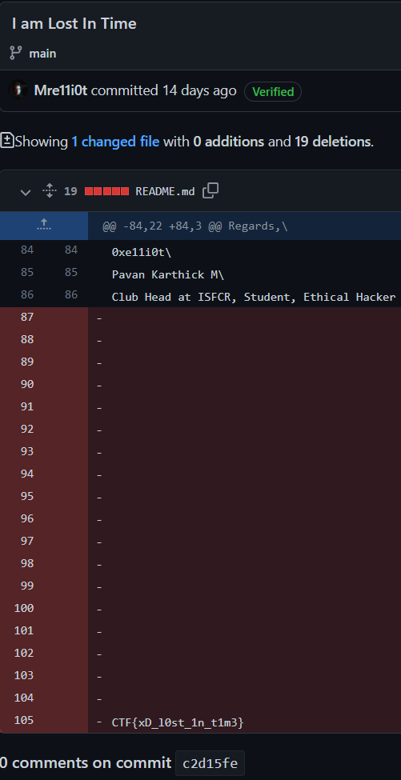

# Cats and Codes

**Category**: OSINT

Our admin @e11i0t posted a new guide for cybersecurity career and something seems fishy there go find it

# Solution

Upon checking through @e11i0t's messages related to cybersecurity (on discord) we obtain this [link](https://bit.ly/cybersecurity-pathway). Upon looking at @e11iot's github check commit history. One of the commits is titled differently from the rest.
Upon viewing the changes in the commit history we find the a flag

# Flag
`CTF{xD_l0st_1n_t1m3}`

# Tools/References