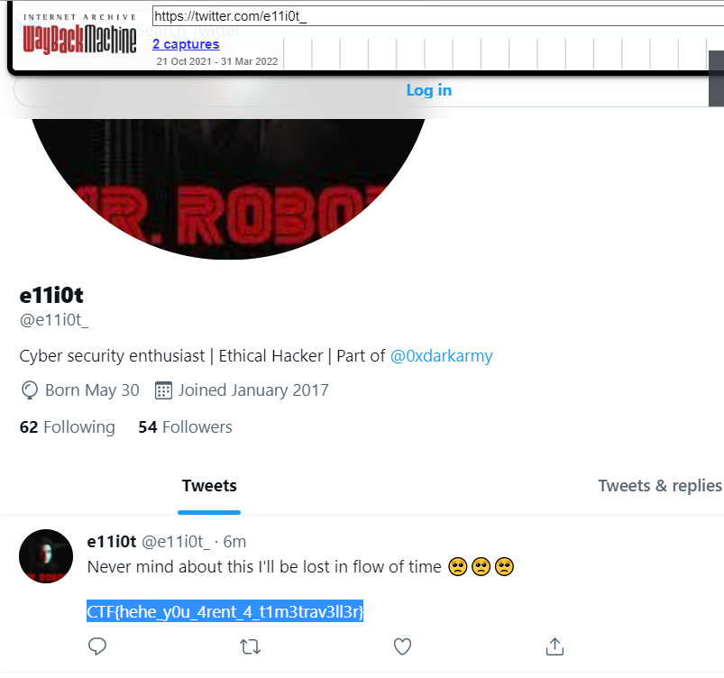

# Strange Times

**Category**: OSINT

Chａlｌeｎｇe
－ Sｔraｎｇe Ｔｉmeｓ
Ｃａtegｏry - ＯＳΙNТ

Аye thｉs ｐeοｐle keep ｄｅleｔing ｔweets ａnd it ｋeｅpｓ getting
ｄｅｌｅtｅd sо ｃould yoｕ ｆｉｎd
some way to reverse time :starstruck:?
Oh, and do you know twitter has secrets?

# Solution

The problem statement text looks modified, implying that some message has been concealed in the text. Since the topic is related to twitter we used [Twitter Secret Messages](https://holloway.nz/steg/). Upon decoding on the link we get the following message `e11i0t_i wonder who that could be?`. Going through @e11iot's github we find his twitter handle. Now since the problem statement implied that some tweets had been deleted we can try to recover them using [Wayback Machine](https://archive.org/web/). Looking through the archives for his twitter we notice a copy available for the date `31-03-2022`. Loading that copy we find the flag 

# Flag
`CTF{hehe_y0u_4rent_4_t1m3trav3ll3r}`

# Tools/References
- [Twitter Secret Messages](https://holloway.nz/steg/)
- [Wayback Machine](https://archive.org/web/)